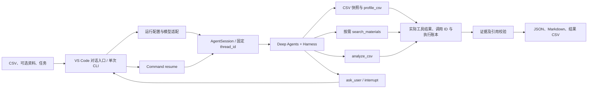

# 架构与下一步

LabWeaver 是通用 CSV 数据任务助手：查看实际字段和数据，按任务决定资料需求，执行受控只读统计，并处理影响结果的澄清。

## 模块职责

`run_config.py` 解析默认、公开 TOML、本地 TOML与入口覆盖；`config.py` 读取模型凭据并构造 ChatOpenAI。配置载入不读取 CSV/资料，离线运行不读取凭据。

`runtime/intake.py` 共用任务读取、模型选择、创建会话和保存报告。VS Code 的 `run_labweaver.py` 收集用户输入、回复澄清、接受追问；CLI intake 保留为单次运行接口。兼容入口 `run_real_checks.py` 复用正常流程。

CSV 工具独立于模型，严格自动识别并解析完整文件，生成只读快照。概览和分析使用同一快照，以一基列位置区分重复表头。analyze_csv 只接受结构化筛选/聚合/排序，不执行任意代码，也不能改变绑定路径。

`tools/analysis_schema.py` 用 Pydantic 定义模型可见的筛选、指标和排序结构，保留整数及编号的原始类型；`tools/csv_analysis.py` 完成独立校验和确定性计算。参数验证失败同样记录到执行边界账本，不能冒充计算成果。

`materials.py` 是资料解析与本地检索服务；模型调用的工具是 Agent 里绑定本次资料的 `search_materials` 包装。文件读取与索引推迟到首次搜索。检索返回真实片段、哈希和位置，引用校验不等于自动证明回答的每句话。

`agent.py` 创建模型执行图、InMemorySaver 与固定 thread_id，并维护会话、任务预算、工具账本及状态。Harness 隐藏并拒绝白名单外的文件/委派等框架工具，要求实际概览先于分析/检索，预算与执行按调用 ID 去重。

`runtime/records.py` 保存严格 JSON、成功任务的 Markdown 与独立结果 CSV。原始日志不发布，输出不覆盖已有文件，写失败只清理当次创建的产物。结果表直接来自实际工具结果。

`offline.py` 是确定性模型测试替身，仍通过真实 Deep Agents 图发出工具调用并读取匹配 ToolMessage；它验证执行流程，不能代表真实 LLM 理解能力。

## 状态与计算边界

- `awaiting_input`：LangGraph 真正中断，待用户输入后恢复同一任务。
- `completed`：工具证据匹配，计算型任务有真实分析结果，资料引用按实际命中校验。
- `error`：解析、模型、预算或证据校验失败，记录原因。
- `cancelled`：用户中止当前任务。

已有确认保留在同一会话中，新任务使用新的任务预算。模型最多 12 次、检索三次、分析四次、澄清三次；恢复不重置。退出程序会丢失内存检查点，JSON 仅是记录。

源文件保持只读。筛选和聚合不是清洗源数据；历史国家标签不会默认合并。数值聚合排除缺失，遇到未排除的非法数值报错；整数求和保持精度。

## 下一步

1. 在当前单 Agent 基线上，用更多真实表结构评估自动读取、澄清质量、检索选择和统计准确率。
2. 任务复杂度需要时加入分析与核验子 Agent，比较准确性、引用支持与调用成本。
3. 若用户需要跨进程恢复，接入持久化 checkpointer，并验证预算、账本和源快照的一致性。
4. 在独立需求下增加清洗、建模与绘图工具，分别定义写入边界与成果验收。

详见 [连续统计实现与验收](session-statistics.md)。历史 D3 的资料检索与简报基线记录保留在 [D3 记录](day3-results.md)。

## 框架来源

- [Deep Agents](https://docs.langchain.com/oss/python/deepagents/overview)：Agent 图与中间件基础。
- [LangGraph 中断与恢复](https://docs.langchain.com/oss/python/langgraph/interrupts)：interrupt、Command 和检查点。
- [Python CSV](https://docs.python.org/3.11/library/csv.html)：严格 CSV 解析。
- [charset-normalizer](https://charset-normalizer.readthedocs.io/en/latest/user/advanced_search.html)：legacy 编码候选推断。

项目特定的 CSV 格式策略、聚合工具、文件绑定、预算/执行账本、证据校验、交互入口和产物保存由 LabWeaver 实现。
