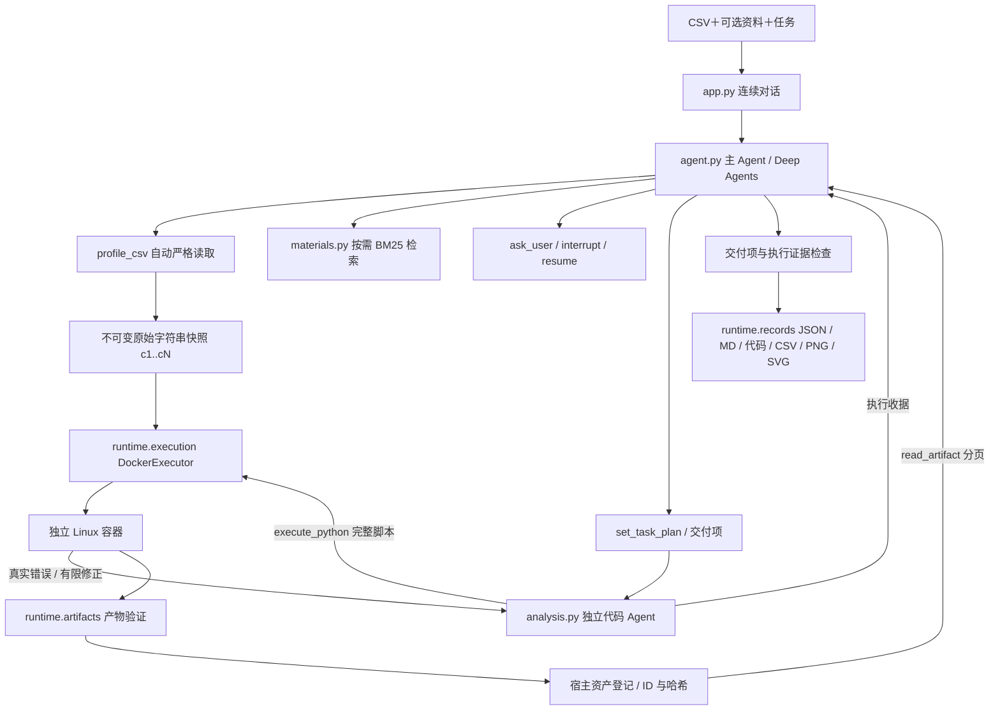

# 现行架构：D5

## 主要模块

| 模块 | 主要职责 |
|---|---|
| `app.py`、`cli.py` | 唯一正式对话入口与保留的 CLI；收集输入、显示流式进度和结果 |
| `config.py`、`run_config.py` | 模型凭证与运行设置分开读取；不把凭证写入记录 |
| `agent.py` | `AgentSession`、`create_session()`、`run_intake()`；主图、计划、委派、RAG、澄清与完成校验 |
| `analysis.py` | `AnalysisRunner.delegate()`；独立 `create_agent` 上下文，完整脚本执行与有限修正 |
| `tools/csv_profile.py` | `load_csv_snapshot()` 严格自动识别和不可变快照；`profile_csv()` 通用概览 |
| `materials.py` | `build_material_index()`、本地解析/切分/BM25；首次检索时才读资料 |
| `runtime/harness.py` | `ExecutionHarness` 过滤实际工具集，校验调用 ID、预算、去重与账本 |
| `runtime/evidence.py` | 消息轨迹、严格 JSON 值和检索引用来源校验 |
| `runtime/execution.py` | `DockerExecutor.preflight/execute/cancel`；新容器、输入暂存、超时/OOM/取消、清理 |
| `runtime/artifacts.py` | `validate_payload()`、`artifact_view()`；文件类型/大小/SVG/哈希与分页 |
| `runtime/records.py` | `save_run()` 排他写入、保存失败回滚、报告和全部产物 |
| `runtime/replay.py` | `replay_analysis()` 验证输入/代码哈希，在原镜像内重放，不调用模型 |
| `runtime/streaming.py` | `stream_execution()`、`ConsoleStream`；公开回答增量与执行进度，子模型正文不显示 |
| `offline.py` | 两个确定性演示模型；测试无需模型网络，计算仍用 Docker |
| `sandbox/` | Docker 构建文件、带哈希依赖锁、容器监督程序与输入/输出 helper |

`create_deep_agent`、`create_agent`、中间件接口、`InMemorySaver`、`interrupt/Command` 来自 LangChain/LangGraph/Deep Agents。数据快照、预算账本、交付协议、Docker 执行器、校验/导出及业务入口由本项目编写。框架默认文件工具与通用委派工具被隐藏并拒绝执行。

## 执行协议与 Harness

原始数据以字符串 JSON 快照进入容器；重复表头使用不同 `cN`，原名在列映射中，前导零、NA、NULL 不自动改变。每次脚本重新 `load_dataset()`，没有隐藏 Notebook 变量。`emit_table()`、`emit_metric()`、`emit_figure()` 只导出，不实现统计业务算法。

生成脚本是容器中独立子进程。父监督程序捕获其 stdout/stderr，扫描临时区中的普通文件，返回有界 JSON/base64 协议。宿主拒绝路径穿越、符号链接、类型/行数不匹配、非有限 JSON、主动脚本与外链 SVG，并计算自己的 ID/哈希。输出总计 50 MiB、每任务最多两图；模型只收到摘要和分页。临时区通过协议在容器退出前读取，停止后移除容器。

容器使用不可变镜像 ID、非 root、无网络、只读根、cap-drop、no-new-privileges、64 PID、2 CPU/1 GiB、128 MiB tmpfs。只挂载当前任务暂存的快照与脚本，不挂载项目、用户目录、源 CSV 或 Docker socket。按 Docker CLI 优先级检查 context/host，只接受本地 Unix/named-pipe endpoint；执行与清理固定使用已校验端点。显式清空代理变量，防止 Docker 客户端配置自动传入代理凭证。

每任务主/代码模型各最多 12 次，委派两次，每委派执行三次，检索三次、澄清三次。相同调用 ID 相同参数只执行一次；重用 ID 改参数拒绝；恢复不中途重置预算。后续新任务预算重置，上下文保留，范围变化需重新执行。

计算产物必须对应计划中的交付项且来自实际成功执行；子 Agent 返回的 ID 要与宿主登记一致。显式图表要求还需真实 figure 产物。纯概览或字段解释可以根据实际概览/检索结果直接交付报告；若记录了 explanation 交付项，answer_deliverables 将其绑定到 final_answer 和输入来源，不伪造代码执行。表格、指标、图表及计算解释不能用正文替代。缺少交付项返回 error，并保存合法的部分成果。校验不证明代码的统计口径必然正确，也不证明每句话都被引用支持。

报告版本为 2。旧 JSON 留在本地，不转换成可恢复会话；内存检查点仅在当前进程有效。成功脚本重放需要相同输入哈希和本地原镜像 ID，重放结果仍需核对表格/指标。
