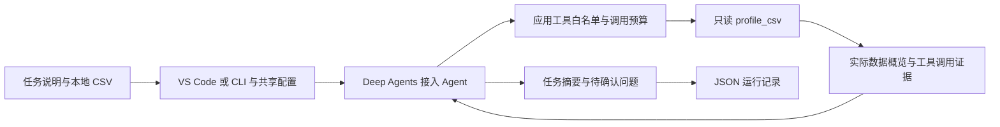

# 架构与下一步

LabWeaver 面向课程、数模和初步科研中的表格数据任务。当前实现项目接入阶段：

## 职责

`run_config.py` 按内置默认、公开 TOML、本地 TOML、入口覆盖的顺序解析运行设置；`runtime/intake.py` 共用任务读取、模型选择和记录保存流程。CLI 只提供 intake；`run_labweaver.py` 是 VS Code 直接运行入口。模型凭据仍由 `config.py` 读取，离线模式不读取凭据。

- CSV 工具按列位置处理任意表头，独立计算真实统计；它不依赖模型，也不修改源文件。
- Agent 解释任务与数据，提出待确认事项；文件通过调用方绑定，模型不能自行选择其他文件。
- 应用中间件限制模型可见工具及实际执行，并计数模型调用、工具尝试。
- 运行状态依据实际执行账本和配对的工具消息确定，不以模型声称“已经检查”作为依据。
- 运行记录不包含 API key，默认写入被 Git 忽略的 runs/。离线模型走相同工具执行流程，且明确标记为离线验证。

## 数据与结论的边界

`profile_csv` 完成只表示 CSV 已按明确规则读取并统计。推断类型并非业务 schema；缺失、极值和均值也不能单独证明数据有效。

Agent 的 `awaiting_confirmation` 表示已取得概览、正在等待用户确认分析目标。没有清洗、建模、图表或完整项目报告的执行工具，因此当前不会执行下一阶段。

## 后续路线

1. 加入用户提供的任务要求与方法资料检索，保留文件、章节和片段出处，评估无答案场景。
2. 在用户确认分析目标后，加入受控的数据分析工具，保存可复现的计算产物。
3. 当任务复杂度需要时增加分析与核验子 Agent，分别评估结果准确性、引用支持和调用成本。
4. 加入持久化阶段状态与恢复验证，明确区分保存记录和恢复运行。

每一步先保留当前单 Agent 基线，用不同表结构和真实任务评估增量收益。micrograd 检查作为历史原型，不是新产品的用户范围。

已确认的下一轮实现范围见 [第三天开发计划](day3.md)；资料检索、引用与 Markdown 简报目前尚未实现。

## 参考

- [Deep Agents](https://docs.langchain.com/oss/python/deepagents/overview)
- [LangChain 中间件](https://docs.langchain.com/oss/python/langchain/middleware)
- [Python CSV](https://docs.python.org/3/library/csv.html)
