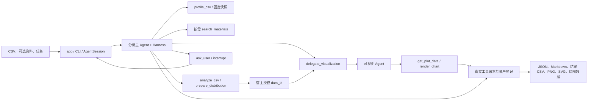

# 架构

LabWeaver 在固定 CSV 快照上执行通用只读统计。分析主 Agent 保留 Deep Agents，受控委派工具调用独立 LangChain 可视化 Agent。两者有独立提示词、消息上下文和工具集合，默认共用模型配置。

## 模块

| 模块 | 职责 |
| --- | --- |
| `app.py` | 唯一正常对话入口；三个日常输入、暂停回复、追问与取消 |
| `cli.py` | 单次 intake、配置覆盖和退出码 |
| `run_config.py` / `config.py` | 公共/本地 TOML 分层、路径校验、模型配置与适配 |
| `agent.py` | 会话、Deep Agents 主图、预算、工具白名单、证据与引用核验 |
| `visualizer.py` | 独立 LangChain 子图、授权数据、子模型预算与真实绘图验证 |
| `tools/` | 严格 CSV 快照、概览、统计、分布和 Matplotlib 绘图模板 |
| `materials.py` | TXT/Markdown/PDF 解析、出处与延迟 BM25 索引 |
| `offline.py` | 确定性双模型演示与验证，仍调用真实工具 |
| `runtime/intake.py` | 模型选择、共享会话和报告保存 |
| `runtime/records.py` | 排他保存 JSON、简报、结果表及会话内部图表资产 |

配置加载不读取 CSV、资料或模型密钥。默认配置来自工作目录，安装位置不决定配置。资料索引在第一次搜索时创建；提供资料不会强制检索。

## 计算与授权

概览、聚合和分布使用同一只读 CSV 快照。列用一基位置标识，保留重复或空表头。分析工具仅接受结构化筛选、聚合、排序和 Top K；不执行模型代码，不接受新文件路径。整数求和保持精度，数值聚合排除空白，未排除的非法或非有限数值报错。

真实统计结果获得 `data_id`，绑定会话、任务、源哈希和计算口径。可视化 Agent 只能调用 `get_plot_data(data_id)` 和 `render_chart(data_id, spec)`，访问本次授权结果；不能提供数据表、路径或代码。绘图数据来自真实统计或完整快照分箱。折线按实际数值、ISO 年月或日期排序，重复横轴先聚合；截断表格注明展示范围。

PNG、SVG 和绘图数据在会话内部登记，并保存来源、图表规格与哈希。图表成功依赖工具账本及资产，子 Agent 的文字回复不构成交付证据。JSON 不包含图片字节或全量原始数值。

## Harness 与状态

主图隐藏默认文件和通用委派工具，只保留受控统计、检索、澄清及可视化委派。子图不询问用户，计算口径由主 Agent 的 `ask_user` / `interrupt` 处理。

| 每任务预算 | 上限 |
| --- | ---: |
| 主模型调用 | 12 |
| 子模型调用总数 | 6 |
| 概览 / 检索 / 分析 / 澄清 | 1 / 3 / 4 / 3 |
| 分布准备 / 可视化委派 | 各 2 |
| 绘图尝试 / 最终图表 | 4 / 2 |

恢复使用同一检查点，预算和执行按调用 ID 去重；新任务开始新预算，保留会话上下文。状态为 `awaiting_input`、`completed`、`error`、`cancelled`。计算型任务必须有真实聚合或分布结果，不能以建议方案替代。引用必须来自实际检索片段。

绘图子任务失败保留已完成统计，明确记录绘图错误；没有委派记录 `not_needed`。更换 CSV 创建新会话。程序退出会丢失内存检查点，JSON 只记录成果。

## 产物与仓库边界

`session.save()` 将当前报告及宿主图表资产交给 runtime。事件按会话/任务分目录，每次使用唯一文件名及排他写入，失败仅清理本次创建的文件。完成事件保存 Markdown，其他状态保留 JSON；成果表和绘图数据由程序生成。

生产入口在包内，测试在 `tests/`，两套演示在 `examples/`。历史临时入口和阶段文档从当前目录移除，Git 历史保留。发布审查包括已跟踪文件的删除和暂存文件归属，忽略规则不能替代删除已跟踪废弃文件。

框架依据：[Deep Agents](https://docs.langchain.com/oss/python/deepagents/overview)、[子 Agent 作为工具](https://docs.langchain.com/oss/python/langchain/multi-agent/subagents)、[LangGraph 中断](https://docs.langchain.com/oss/python/langgraph/interrupts)。CSV 策略、统计模板、授权、预算、证据核验与产物保存由 LabWeaver 实现。
