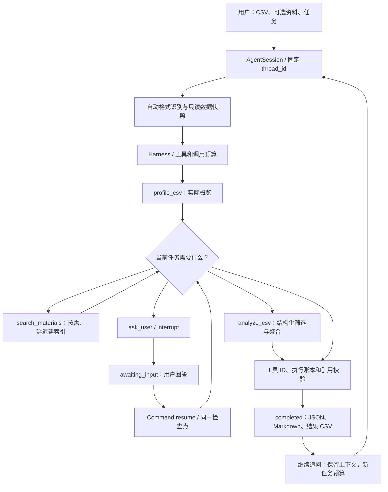

# 自动读取、按需检索与连续统计：实现与验收

本轮将“概览后提出方案”升级为可完成只读 CSV 统计的单 Agent。历史 D2/D3 文档中的 awaiting_confirmation 是旧状态；现用 completed、awaiting_input、error、cancelled。

## 执行链



自动识别处理 BOM、UTF-8、常见 legacy 编码与四种分隔符；确定格式后严格解析全文件。失败与歧义不输出假全量统计。快照供概览和后续统计共同使用，模型不能更换绑定文件。

提供资料代表搜索能力可用，搜索不再是所有任务的必经步骤。没有资料时可独立完成统计；依赖未知规则时才询问。引用只允许使用实际返回的片段。

## 公开接口

```python
from labweaver.agent import create_session

session = create_session(csv_path, model, material_paths=material_paths)
report = session.invoke(task)
if report["status"] == "awaiting_input":
    report = session.resume(user_reply)
report = session.invoke(follow_up)
# 需要中止待回答任务时：
# report = session.cancel()
```

图和模型绑定只建立一次，InMemorySaver 与固定 thread_id 保留当前进程内的会话。恢复可能重执行中断节点，因此实际账本和预算按 tool_call_id 去重。每个任务最多 12 次模型、3 次搜索、4 次分析、3 次澄清；恢复不重置，新任务重置任务预算并保留上下文。

run_intake 是单次调用兼容包装。CLI 同样单次调用，awaiting_input 的退出码为 3；VS Code 入口负责用户回复与追问循环。

## 产物

`runs/<session_id>/<task_id>/` 下每个事件保存一个唯一 JSON。待回答、错误与取消事件不生成成功简报；完成事件生成同 stem Markdown。真实分析结果另保存 `<stem>-result-1.csv` 等独立结果文件。

JSON 包含消息、确认回复、实际解析设置、源哈希、工具调用/结果/执行账本、分析表、检索查询/片段/引用与状态。输出采用严格 JSON，禁止 NaN/Infinity。写入失败只清理由本次创建的新文件，原有产物不覆盖。

JSON 的表格、Markdown 的程序表格、独立 CSV 均由 analyze_csv 的真实结果生成。自然语言仍应由用户核对。引用校验确认真实出处，不证明每句话有充分支持。

## 必须覆盖的验收

| 类别 | 用例 | 成果检查 |
| --- | --- | --- |
| 自动读取 | UTF-8/BOM、GB18030、UTF-16/32 BOM、逗号/分号/Tab/竖线 | 实际格式、正确行列、源哈希 |
| 严格解析 | 引号内换行、单列、后段畸形、格式歧义 | 不降级为假单列；明确错误/候选 |
| 自主检索 | 无资料、有资料不需要、明确依据资料、无命中 | 实际工具执行与真实引用 |
| 确定计算 | 合成问卷、实验、奖牌数据 | 手算表格、口径、整数精度 |
| 连续对话 | 问口径 → 回复 → 真正计算 → 2024 追问 | 同一会话，新任务预算，ID 去重 |
| 边界 | 非法数值、工具预算、伪造引用、资料内指令 | 受控失败，源不修改 |
| 入口/产物 | VS Code 三项输入、恢复、追问、取消 | JSON/Markdown/结果 CSV 一致 |
| 离线 | 真实 Deep Agents 工具循环 | 不读凭据，零网络请求 |

在 VS Code 测试面板运行全部测试，或打开 `verify_d3.py` 点击 Run Python File，进行十二项离线成果验收。该文件保留旧名称，但验收内容已升级为真实检索与澄清后计算、追问、成果导出。真实在线检验步骤与两项奖牌参考答案见 [真实数据检验](real-data-checks.md)。离线测试通过与真实 API 通过需要分别记录；CI 使用公开合成数据，不发送模型请求。

## 实际验证记录

2026-10-07 本地验收：完整离线回归 **369 passed、28 subtests passed**；一键验收 **12/12**，另外通过两个配置驱动的离线入口与静态代码检查。

真实案例自动识别为 UTF-8、逗号，**1435 行、7 列**。CSV SHA-256 为 `84ac7c96c36f3fb50e440768091c59a35acbbccf65edc9aebbd2e7531cb76999`。已与 [COMAP 官方公开数据](https://www.contest.comap.org/undergraduate/contests/mcm/contests/2025/problems/) 逐字节核对；本地题目 PDF 的四页提取文字与官方版本一致。个人目录、源文件和原始运行日志没有提交。

采用现有 OpenAI 兼容接口的 `deepseek-flash`，实际在线结果为：

| 任务 | 实际执行与成果 |
| --- | --- |
| 模糊的国家前五任务 | 2 次模型调用后 `awaiting_input`，真实 interrupt 提问一次 |
| 回复“全部年份、按 Total 累计、保留原始 NOC” | 同一任务累计 4 次模型调用；概览、提问、分析各一次；United States 2583、Great Britain 944、Soviet Union 907、France 792、China 727 |
| 追问“改为 2024 年” | 新任务 2 次模型调用、分析一次，未重复概览或提问；United States 126、China 91、Great Britain 65、France 64、Australia 53 |
| 资料可用但要求独立 CSV 统计 | 概览一次、分析一次、检索零次，全部年份前五匹配 |
| 明确依据竞赛说明，范围和 Total 口径已明确 | 模型 4 次、概览一次、检索两次、分析一次；全部年份前五匹配，实际引用 `[D1-C2]`，有 PDF 页码 |

以上完成任务均生成 JSON、Markdown 和独立结果 CSV，原始 CSV/PDF 哈希不变。公开合成样例也通过在线澄清、追问、可选零检索与实际检索引用。在线模型不是确定性测试替身，未来仍可能返回解析、工具或引用失败；失败记录不标为完成。

初验发现过漏写引用和接口不支持强制 `tool_choice` 的情况；最终实现保留引用校验，向每次模型调用说明实际开放的工具及检索出处，并采用接口默认的工具选择方式。检索和独立统计允许在概览后的同一轮并行；关键年份口径未确认时，统计执行边界仍拒绝提前计算。格式选择回复不算业务口径确认。

远程 CI 覆盖 Ubuntu/Windows × Python 3.11/3.12，执行锁文件安装、完整离线回归、两个示例入口和十二项成果验收。每次追加提交会自动触发，实际运行记录见 [GitHub Actions](https://github.com/pypypaoying/LabWeaver/actions/workflows/tests.yml)。CI 不读取模型密钥或真实用户数据。
